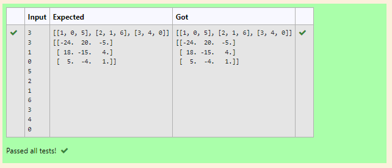

# Inverse-of-matrix

## AIM:

## ALGORITHM:
### Step 1:
import numpy module

### Step 2:
create a for loop with range of rows
### Step 3:
create another for loop with range of columns
### Step 4:
using numpy.linalg.inv func get inverse of matrix
### Step 5:
display the output

## PROGRAM:
```
import numpy
rows=int(input())
columns=int(input())
l1=[]
for i in range(rows):
    temp=[]
    for j in range(columns):
        t=int(input())
        temp+=[t]
    l1+=[temp]
print(l1)
print(numpy.linalg.inv(l1))
```

## OUTPUT:


## RESULT:
